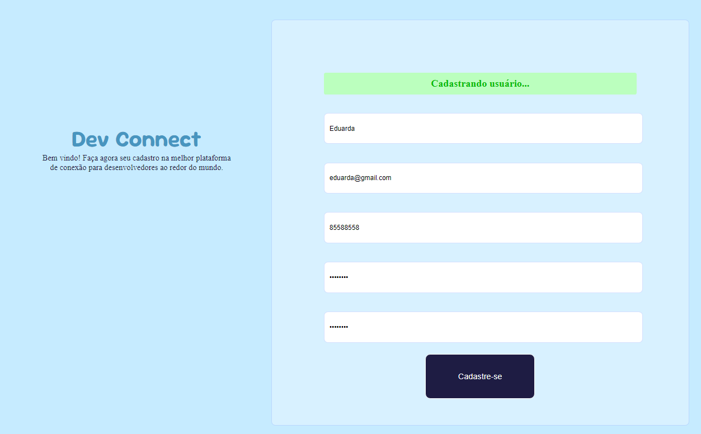
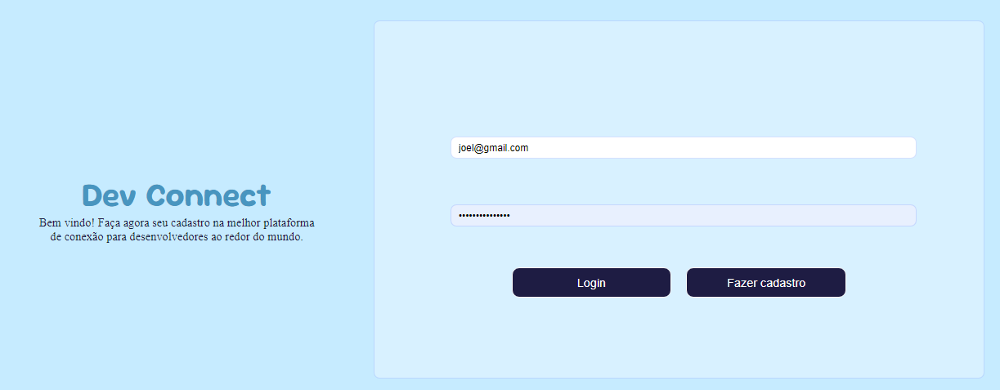

<h1 align="center"> DevConnect - Projeto Prático </h1>

Esse projeto foi desenvolvido conforme o que foi ensinado no curso gratuito de programação FullStack disponibilizado pelo Juventude Digital.

  <a href="#-tecnologias">Tecnologias</a>&nbsp;&nbsp;&nbsp;|&nbsp;&nbsp;&nbsp;
  <a href="#-projeto">Projeto</a>&nbsp;&nbsp;&nbsp;|&nbsp;&nbsp;&nbsp;
  <a href="#memo-licença">Licença</a>

  

## 🚀 Tecnologias

Esse projeto foi desenvolvido com as seguintes tecnologias:

- HTML e CSS
- JavaScript
- Git e Github

## 💻 Projeto

Parabéns, Aspirante a Programador(a)! 🚀 Você acaba de ser contratado(a) pela DevConnect, uma startup revolucionária que está construindo a melhor plataforma de conexão para desenvolvedores ao redor do mundo. A missão da equipe é criar a página de cadastro da plataforma. Ela deve ser robusta e elegante que permita aos futuros usuários criarem suas contas gratuitamente.

O sucesso da DevConnect depende de você e de sua equipe! Seu desafio é criar a página de cadastro, a primeira impressão que os usuários terão da nossa plataforma.

A primeira Missão
Desenvolver uma página de cadastro funcional e estilizada, com foco na experiência do usuário. A página será o coração da plataforma, onde novos desenvolvedores se juntarão à nossa comunidade global.

Requisitos da Missão
Campos de Entrada:
Os usuários devem fornecer as seguintes informações para criar uma conta:

Nome completo
Email
Contato
Senha
Confirmação de senha
Botão de Submissão:
Um botão para enviar os dados e concluir o cadastro.

  

A segunda Missão:
Crie uma página de login com o cadastro feito, e usando JavaScript e JSON faça um banco de dados local para conseguir fazer o login em nossa plataforma.

Requisitos da Missão
Campos de Entrada:
Os usuários devem fornecer as seguintes informações para criar uma conta:

Nome completo
Email
Senha
Confirmação de senha
Botão de Submissão:
Um botão para enviar os dados e realizar o login.

  

Design Intuitivo:
A interface deve ser atraente e fácil de usar, mantendo a identidade visual da startup.

Instruções Especiais da Equipe DevConnect
Centralização e Estilo: Nossa página precisa impressionar desde o início! Certifique-se de que o formulário esteja centralizado e estilizado de forma profissional.
Prontidão para Validações Futuras: A versão atual não requer validações de formulário, mas já prepare o layout pensando em implementações futuras.
Trabalho em Equipe: Colabore com seus colegas, compartilhe ideias e lembre-se de que a força da DevConnect está em sua equipe!
Seu Impacto

Ao concluir esse desafio, você terá criado a base para a comunidade DevConnect e ajudará a conectar desenvolvedores de todo o mundo. Boa sorte, Dev Hero! 🌐

## :memo: Licença

Esse projeto está sob a licença MIT.

---

Feito por Joel e Eduarda.
